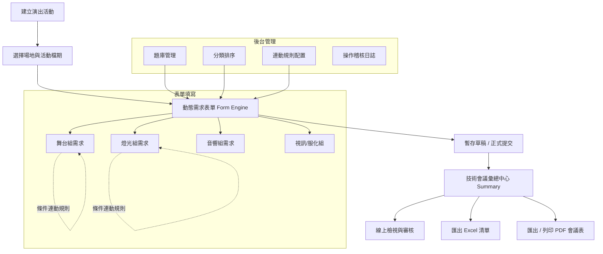

# 🎭 演出技術會議需求管理系統 (Event Technical Requirement Management System)

<div align="center">


**專為表演藝術場館與演出製作團隊打造的跨組別技術需求收集、條件連鎖決策與會議彙總管理平台**

[快速開始](#-快速開始) • [系統特色](#-核心特色) • [功能架構](#-系統架構與流程) • [頁面導覽](#-系統頁面導覽) • [資料庫與種子資料](#-資料庫與題庫設定)

</div>

---

## 🌟 核心特色

- **🎯 動態表單引擎 (Dynamic Form Engine)**
  - 支援單選、多選、文字、數字、下拉選單、日期與文字區塊等多種題型。
  - 支援設定預設值、必填驗證、題項說明與單位提示。

- **🔗 條件式連鎖規則 (Conditional Logic Engine)**
  - 當特定題目選擇特定選項時，自動觸發/隱藏後續相關子題目（如：選擇「需要懸吊」才展開「懸吊點數與載重」）。

- **📑 跨專業分類分頁 (Multi-Category Tabs)**
  - 涵蓋 **一般資訊、舞台組、燈光組、音響組、視訊組、服裝化妝、技術協調** 等專業領域，組別間可獨立切換填寫與暫存。

- **📊 智慧技術需求彙總 (Technical Requirement Summary)**
  - 自動彙整所有專業組別已填答內容，過濾未填題目，以專業技術會議格式呈現。
  - 支援一鍵產生 **Excel (.xlsx)** 清單與 **PDF 會議手冊**（含列印排版優化）。

- **⚙️ 後台題庫與規則管理 (Admin Console)**
  - 可線上增刪修題庫題目、調整題型與選項。
  - 可自訂分類排序、設定題目的連動規則。
  - 完整記錄管理員變更操作之 **稽核歷程 (Audit Logs)**。

---

## 🏗️ 系統架構與流程



---

## 🚀 快速開始

### 方式 A：本地執行（Local Setup）

#### 1. 取得原始碼
```bash
git clone https://github.com/needlovechen-rgb/NTCHrepo.git
cd NTCHrepo
```

#### 2. 安裝相依套件
```bash
npm install
```

#### 3. 初始化資料庫與預設題庫
```bash
npx prisma db push
npm run seed
```

#### 4. 啟動開發伺服器
```bash
npm run dev
# 或 Windows PowerShell 下：
cmd /c npm run dev
```
啟動後打開瀏覽器訪問：**`http://localhost:3000`**

---

### 方式 B：GitHub Codespaces 線上免安裝執行

1. 在 GitHub 倉庫首頁點擊 **「<> Code」** ➔ **「Codespaces」** ➔ **「Create codespace on main」**。
2. 終端機載入完成後依序執行：
   ```bash
   npm install
   npx prisma db push
   npm run seed
   npm run dev
   ```
3. 點擊右下角彈出的 **Open in Browser** 即可在雲端瀏覽器直接操作。

---

## 🖥️ 系統頁面導覽

| 頁面 | 路由位址 | 主要功能 |
| :--- | :--- | :--- |
| **首頁（專案清單）** | `/` | 瀏覽全部活動專案、活動狀態、新增專案、複製專案與快速入口 |
| **動態需求表單** | `/form/[eventId]` | 填寫各專業組別技術需求、自動暫存草稿、連鎖題型即時計算 |
| **需求彙總中心** | `/summary/[eventId]` | 跨組別技術需求總表檢視、統計、Excel 匯出與 PDF 產出 |
| **列印專用頁面** | `/print/[eventId]` | 符合 A4/Letter 會議排版規格的無障礙列印預覽頁 |
| **後台管理系統** | `/admin` | 題庫題目維護、分類設定、條件觸發規則設定與操作日誌 |

---

## 📁 專案目錄結構

```text
├── prisma/
│   ├── schema.prisma         # Prisma 資料庫結構定義
│   └── seed.ts               # 場地、預設題庫、分類與規則種子資料
├── src/
│   ├── app/
│   │   ├── admin/            # 後台管理介面
│   │   ├── api/              # 後端 REST API (Events, Venues, Admin, Export)
│   │   ├── form/[eventId]/   # 動態需求填寫表單頁
│   │   ├── summary/[id]/     # 需求彙總頁面
│   │   ├── print/[id]/       # 列印排版頁面
│   │   ├── globals.css       # 全域樣式與 Tailwind 設置
│   │   ├── layout.tsx        # 頂部導覽列與全域版型
│   │   └── page.tsx          # 專案清單首頁
│   ├── components/
│   │   └── form-engine/      # 表單引擎與各式 Widget (Checkbox, Radio, Dropdown...)
│   ├── lib/
│   │   ├── db.ts             # Prisma Client 單例實例
│   │   └── ruleEngine.ts     # 條件式規則比對引擎核心邏輯
│   ├── services/             # 商業邏輯服務層 (Event, Summary, Excel, PDF, Rules)
│   └── types/                # TypeScript 型別定義
└── README.md
```

---

## 📦 資料庫與題庫設定

本專案預設使用 **SQLite**，檔案會自動生成於 `prisma/dev.db`（已排除於 Git 追蹤，保護資料隱私）。

- **預設場地**：國家戲劇院、國家音樂廳、實驗劇場、演奏廳等。
- **預設分類**：舞台組、燈光組、音響組、視訊組、服裝化妝、技術協調。
- **自訂修改**：可在後台 `/admin` 介面即時調整，或修改 `prisma/seed.ts` 後重新執行 `npm run seed`。

---

## 📄 授權說明
本專案依據 MIT License 進行授權與開源。
